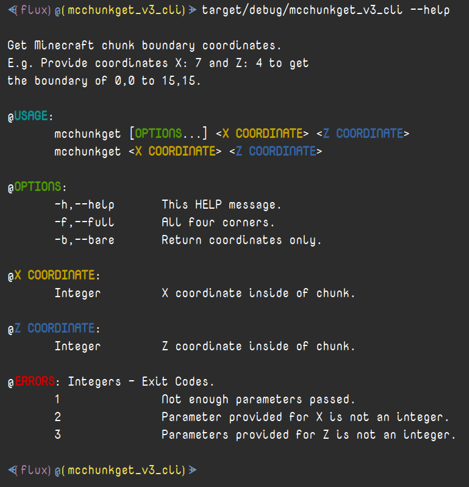
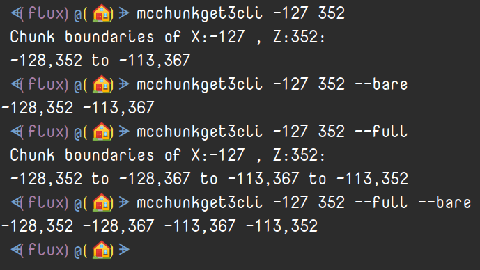

# MC Chunk Get V3 - CLI Edition


|`Build`|`Status`|
|---:|:---|
![Build Status](https://img.shields.io/static/v1?logo=data:image/png;base64,iVBORw0KGgoAAAANSUhEUgAAAA4AAAAOCAMAAAAolt3jAAAABGdBTUEAALGPC/xhBQAAACBjSFJNAAB6JgAAgIQAAPoAAACA6AAAdTAAAOpgAAA6mAAAF3CculE8AAAB11BMVEUAAAA9U2GDnayLpraOqLeQqbiRqriPqLaPqLaRqriDnaw9U2Fid4SKp7iKp7hid4RfdYGHpbdYbnuCorRSaHV9nrFMYm93ma1HXGlwlKlwlKlBV2NojqQ7UV1hiKA2S1hYgpswRlJQfJcwRlIkMjlDbIVMfJpNfptOfptNfZpRfplTf5lMfJlOfptNfptDbIUkMjkHAAAuR1YzUWMzUWMzUmM0UmQzUWMyUWM0UmQzUmMzUWMzUWMuR1YHAACNsMWRs8aXt8mbuMm3ydSbuMmRs8aIrsONscWStMeZtsfk6u3k6u2ZtseStMeIrsOGrMKKr8SMr8Oswc3u8PHu8PGswc6Mr8OCqcCFrMKJrsOTssTT3OLS3OKTssSJrsOCqcB9pr5/p7+CqcCApryYs8Sdt8aApryCqb9/p799pr52obp4o7x9o7qswc7F09vO2eCwxNCCp7x4ort2obpvnLdxnbd9orjK1t3T3OLK1t7Y4OSFp7twnLZvnbdomLRolrKTsMHb4eWju8mRrsDd4+aiushplrJomLRhkrBik7Bmkq25ydLY3uLW3eHI09ptl69hkrBhkrBZjq1bj65ej613nbSRrr+etsV3nbRika1bjq5Zjq3///97NWaUAAAAP3RSTlMAAlOMioqKioqKUwIMwcEMDsQOxA7EDsQOxMQOxA7EDsQOxA4Lq/Lv7+/v7+/v76sLASI+Pj4+Pj4+Pj4+IgH2SccMAAAAAWJLR0SccbzCJwAAAAd0SU1FB+QIGBYnM5liyzQAAADPSURBVAjXY2BABYxMzCysbOwcnKwszFzcDDy89g6OTs7OLo6u9nz8DAKCbu4enl7ePr7ufoICDELC/gGBQcEhoWEB/sJCDCKi4RGRUdExsXER8aIiDGLiCYlJySmpaekZmeJiDBKSWdk5uXn5BYVFxVISDNIyJaVl5RWVVdU1tTLSDLJydfUNjU3NLa1t7XKyDPIKHZ1d3T29ff0TJirIMygqTZo8Zeq06TNmzpqtpMygoqqmrqGppa2jq6emb8BgaGRsYmpmbmFpZW1jawcAIDgy9UQeYeoAAAAldEVYdGRhdGU6Y3JlYXRlADIwMjAtMDgtMjRUMjI6Mzk6NTEtMDQ6MDBWWeqAAAAAJXRFWHRkYXRlOm1vZGlmeQAyMDIwLTA4LTI0VDIyOjM5OjUxLTA0OjAwJwRSPAAAAABJRU5ErkJggg==&label=AppImage&message=Status&color=b91d47)|

## Table of Contents
- [MC Chunk Get V3 - CLI Edition](#mc-chunk-get-v3---cli-edition)
  - [Table of Contents](#table-of-contents)
  - [Description](#description)
    - [What is this?](#what-is-this)
    - [Environment](#environment)
    - [History](#history)
  - [Motivation](#motivation)
    - [Project Motivation](#project-motivation)
    - [Rewrite Motivation](#rewrite-motivation)
  - [Usage](#usage)
    - [Help Message](#help-message)
    - [Linux](#linux)
      - [Installation](#installation)
        - [Shell](#shell)
      - [DPKG Intsall](#dpkg-intsall)
        - [DEB Installer Shell Script](#deb-installer-shell-script)
      - [Command Line Examples](#command-line-examples)
    - [Windows](#windows)
      - [Installation](#installation-1)
        - [CMD](#cmd)
        - [PowerShell](#powershell)
      - [Command Line Examples](#command-line-examples-1)
  - [Project](#project)
    - [Continuous Build - RECOMMENDED](#continuous-build---recommended)
    - [Direct Files](#direct-files)
      - [Linux](#linux-1)
      - [Windows](#windows-1)
    - [Project Links](#project-links)
    - [Project Status](#project-status)
  - [Media](#media)
    - [Logo](#logo)
    - [Help Screen](#help-screen)
    - [Demonstration](#demonstration)
  - [License](#license)

## Description

### What is this?

This is a tool that calculates the chunk boundary coordinates of a chunk by providing a pair of`X`,`Z` coordinates within that chunk in ***Minecraft***. 

### Environment

This *command line utility* is written in the programming language **Rust** (*rustlang*); cross platform for use in any command line, terminal/console, script, or program in ***Windows*** and ***Linux***.

These are all executable binary files; the *Windows* version is a `.exe`, but the *Linux* has 2 executable methods: a normal `file` and a `.AppImage`.

### History

This is the 3rd version of this program with script and function variations in 5 or 6 programming/scripting languages.

1. The `1st` version is a ***Windows*** GUI written in the scripting langauge **AutoHotkey**.

2. The `2nd` version is cross platform for ***Windows*** and ***Linux*** written in the programming language **Python**.
3. The `3rd` version (this version) is cross platform for ***Windows*** and ***Linux*** written in the programming language **Rust**.
   1. This is a 2 part program with a CLI and GUI.
      1. The CLI version is complete; you are here.
      2. The GUI version is will be started right after this is released.

## Motivation

### Project Motivation

While I don't get to play as much as I like anymore (that adulting thing, you know?) I like to build lots of things in ***Minecraft*** and for various reasons I need/want to calculate chunk edges, especially when building farms and villages. This tool comes in handy when doing large projects and can be used to generate cooridinates programmatically.

### Rewrite Motivation

I learn lots of different programming languages and **Rust** is a new favorite. No other motivation needed, lol.

## Usage

This is a *command line utility* and can be used in any way you can use any other cli tool in both ***Windows*** and ***Linux***.

There are several ways to download/install/use this; in *Windows* this is portable for now, but in *Linux* you can use it portably or install it with a `.deb` package. I have no repository at the moment, but here you will find instructions to download and install it via a script or just using `dpkg`.

If you are using this portably you can use it by running it from the direct/relative path or from just the executable name if it's in your relative `$PATH` (*Linux*) &`%PATH%` (*Windows*) environments. If you want to run it without a direct *PATH* then please see the corresponding `Installation` section.

Of course, if you installed this via `dpkg` then it should automatically be in `$PATH`.

The *Linux* `file` and `.AppImage` and the *Windows* `.exe` executables are used in the exact same way.

### Help Message

```Bash
 $ mcchunkgetcli --help

 Get Minecraft chunk boundary coordinates.
 E.g. Provide coordinates X: 7 and Z: 4 to get
 the boundary of 0,0 to 15,15.

 @USAGE:
	mcchunkget [OPTIONS...] <X COORDINATE> <Z COORDINATE>
	mcchunkget <X COORDINATE> <Z COORDINATE>

 @OPTIONS:
	-h,--help	This HELP message.
	-f,--full	All four corners.
	-b,--bare	Return coordinates only.

 @X COORDINATE:
	Integer		X coordinate inside of chunk.

 @Z COORDINATE:
	Integer		Z coordinate inside of chunk.

 @ERRORS: Integers - Exit Codes.
	1		Not enough parameters passed.
	2		Parameter provided for X is not an integer.
	3		Parameters provided for Z is not an integer.

```

### Linux

#### Installation

Place the executable *binary* (`file`) or *AppImage* (`.AppImage`)anywhere in your `$PATH` directories. Either of these files can, of course, be renamed to anything you like, but the various versions you find here will have different file names when you download them. In the examples you find here I will use one filename.

Use the following commands in any *Linux* shell to view the directories in `$PATH`:

##### Shell

```Bash
echo "$PATH"
# or
printf '%s\n' "$PATH"
```

As with all executable files in *Linux* you may have to set the persmissions for the file to be executable:

```Bash
# Render executable for self
chmod u+x /path/to/mcchunkgetcli
# for all
chmod +x /path/to/mcchunkgetcli
```

#### DPKG Intsall

You can install this to `/usr/bin` (in `$PATH`) with the `.deb` *Debian* package.

```Bash
sudo dpkg -i /path/to/mcchunkgetcli.deb
```

and uninstall with:

```Bash
sudo apt remove mcchunkgetcli # -y switch for auto confirm
```

##### DEB Installer Shell Script

I've written a `shell script` to help download and install the `.deb` package. It is dependant upon `Curl` and will prompt to install it if necessary. This script prompts for `sudo` and so there is no need to run the script as such.

This *shell script* [mcchunkgetcli_deb_installer.sh](src/linux/target/deb/mcchunkgetcli_deb_installer.sh) is officially found in the section:
`Projects -> Direct Files -> Linux`
and can be installed with:
```Bash
./mcchunkgetcli_deb_installer.sh
```
this will download the `.deb` install file with `curl` to `/tmp/mcchunkgetcli_deb_installer.sh` and run:
```Bash
dpkg -i /tmp/mcchunkgetcli_deb_installer.sh
```

You can, of course, do this all manually with the alternate instructions found here.

#### Command Line Examples

Get the chunk boundary coordinates of `X:11`,`Z:-535` if in `$PATH`:

```Bash
 $ mcchunkgetcli 11 -535
 Chunk boundaries of X:11 , Z:-535:
 0,-544 to 15,-529
```

Get the `bare` chunk boundary coordinates of `X:11`,`Z:-535` if not in `$PATH`:

```Bash
 $ /path/to/mcchunkgetcli --bare 11 -535
 0,-544 15,-529
```

### Windows

#### Installation

Place the executable *binary* (`.exe`) anywhere in your `%PATH%` directories. This file can, of course, be renamed to anything you like, but the various versions you find here will have different file names when you download them. In the examples you find here I will use one filename.

Use the following commands in any *Windows* console to view the directories in `%PATH`%:

##### CMD

```CMD
echo "%PATH%"
```

##### PowerShell

```PowerShell
Write-Host $Env:PATH
```

#### Command Line Examples

Get the `full` chunk boundary coordinates of `X:11`,`Z:-535` in `CMD` if in `%PATH%`:

```CMD
 > mcchunkgetcli.exe --full 11 -535
 Chunk boundaries of X:11 , Z:-535:
 0,-544 to 0,-529 to 15,-529 to 15,-544
```

Get the `full` and `bare` chunk boundary coordinates of `X:11`,`Z:-535` in `PowerShell` if not in `%PATH%`:

```PowerShell
 >>> & 'C:\Path\To\mcchunkgetcli.exe' --full --bare 11 -535
 0,-544 0,-529 15,-529 15,-544
```

## Project

The `Continuous Build` section is the place for the all of the **current releases**; these are the recommended downloads.

The `Direct Files` section contains links to all executable files for this project.

The `Project Links` section provides links to the various presentations of this project.

### Continuous Build - RECOMMENDED

|Link|Description|
|:---:|:---|
|[Continuous Build](https://github.com/Lateralus138/MC-Chunk-Get-V3-CLI/releases/tag/Continuous)|Link to all *current releases*.|

### Direct Files

#### Linux

|File|Description|
|:---:|:---|
|[mcchunkgetcli](src/linux/target/debug/mcchunkgetcli)|Executable Linux file - Main File.|
|[mcchunkgetcli-x86_64.AppImage](src/linux/target/appimage/mcchunkgetcli-x86_64.AppImage)|Executable Linux file - AppImage File. |
|[mcchunkgetcli.deb](src/linux/target/deb/mcchunkgetcli.deb)|Debian package installer.|
|[mcchunkgetcli_deb_installer.sh](src/linux/target/deb/mcchunkgetcli_deb_installer.sh)| Shell script that will download and install the `.deb` install.|

#### Windows

|File|Description|
|:---:|:---|
|[mcchunkgetcli.exe](src/windows/target/debug/mcchunkgetcli.exe)|Executable Linux file - Main File.|

### Project Links

I will be adding more when I finish the GUI version.

|Link|Description|
|:---:|:---|
|[This Repository](https://github.com/Lateralus138/MC-Chunk-Get-V3-CLI)|This page.|
|[This Repository - Themed](https://lateralus138.github.io/MC-Chunk-Get-V3-CLI)|This page - themed version.|
|[Continuous Build](https://github.com/Lateralus138/MC-Chunk-Get-V3-CLI/releases/tag/Continuous)|Link to all *current releases*.|

### Project Status 

|Description|Status|
|:---:|:---:|
|Project Release Date||
|Total downloads for this project||

## Media

### Logo


### Help Screen



### Demonstration



## [License](LICENSE)

>This program is free software: you can redistribute it and/or modify it under the terms of the GNU General Public License as published by the Free Software Foundation, either version 3 of the License, or (at your option) any later version.

>This program is distributed in the hope that it will be useful, but WITHOUT ANY WARRANTY; without even the implied warranty of MERCHANTABILITY or FITNESS FOR A PARTICULAR PURPOSE.  See the GNU General Public License for more details.